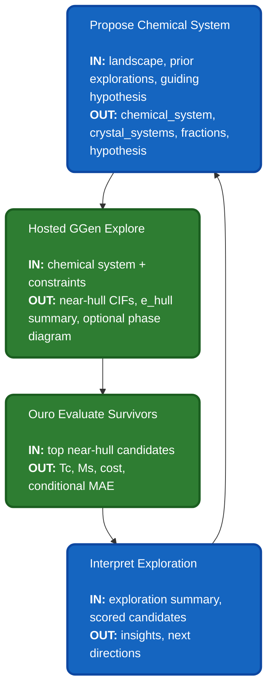

```mermaid
graph TB
    PCS["<div style='text-align:left'>Propose Chemical System<br/><br/><b>IN:</b> landscape, prior explorations, guiding hypothesis<br/><b>OUT:</b> chemical_system, crystal_systems, fractions, hypothesis</div>"]

    GGEN["<div style='text-align:left'>Hosted GGen Explore<br/><br/><b>IN:</b> chemical system + constraints<br/><b>OUT:</b> near-hull CIFs, e_hull summary, optional phase diagram</div>"]

    EVAL["<div style='text-align:left'>Ouro Evaluate Survivors<br/><br/><b>IN:</b> top near-hull candidates<br/><b>OUT:</b> Tc, Ms, cost, conditional MAE</div>"]

    IER["<div style='text-align:left'>Interpret Exploration<br/><br/><b>IN:</b> exploration summary, scored candidates<br/><b>OUT:</b> insights, next directions</div>"]

    PCS --> GGEN
    GGEN --> EVAL
    EVAL --> IER
    IER --> PCS

    classDef signature fill:#1565c0,stroke:#0d47a1,stroke-width:3px,rx:10,ry:10,color:#ffffff
    classDef compute fill:#2e7d32,stroke:#1b5e20,stroke-width:3px,rx:10,ry:10,color:#ffffff

    class PCS,IER signature
    class GGEN,EVAL compute
```
