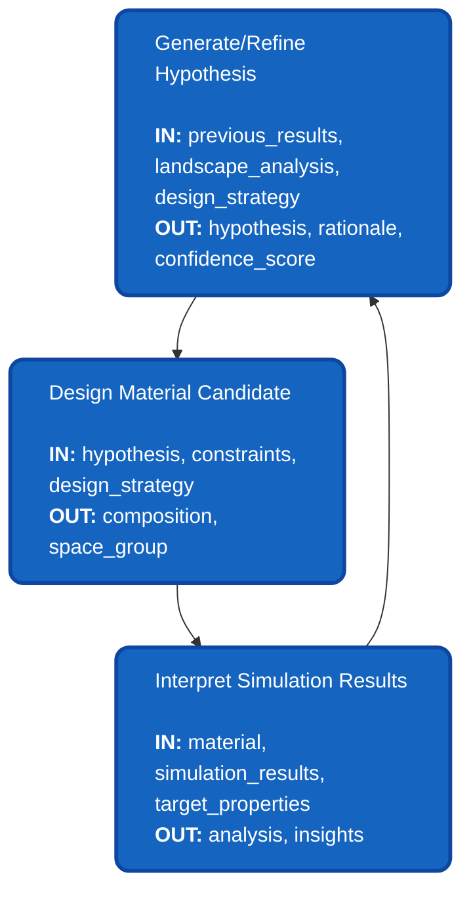

```mermaid
graph TB
    %% DSPy Signatures with Input/Output
    GH["<div style='text-align:left'>Generate/Refine Hypothesis<br/><br/><b>IN:</b> previous_results, landscape_analysis, design_strategy<br/><b>OUT:</b> hypothesis, rationale, confidence_score</div>"]
    
    DMC["<div style='text-align:left'>Design Material Candidate<br/><br/><b>IN:</b> hypothesis, constraints, design_strategy<br/><b>OUT:</b> composition, space_group</div>"]
    
    ISR["<div style='text-align:left'>Interpret Simulation Results<br/><br/><b>IN:</b> material, simulation_results, target_properties<br/><b>OUT:</b> analysis, insights</div>"]
    
    %% Flow in triangle
    GH --> DMC
    DMC --> ISR
    ISR --> GH
    
    %% Styling with better contrast
    classDef signature fill:#1565c0,stroke:#0d47a1,stroke-width:3px,rx:10,ry:10,color:#ffffff
    
    class GH,DMC,ISR signature
```