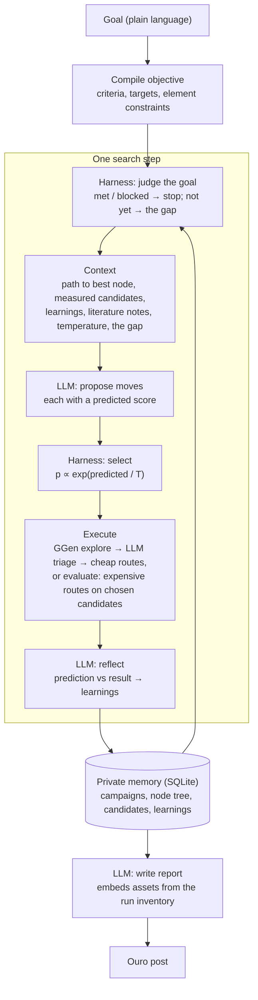

```mermaid
graph TB
    GOAL["Goal (plain language)"] --> OBJ["Compile objective<br/>criteria, targets, element constraints"]
    OBJ --> JUDGE

    subgraph step [One search step]
        JUDGE["Harness: judge the goal<br/>met / blocked → stop; not yet → the gap"]
        CTX["Context<br/>path to best node, measured candidates,<br/>learnings, literature notes, temperature, the gap"]
        PROP["LLM: propose moves<br/>each with a predicted score"]
        SEL["Harness: select<br/>p ∝ exp(predicted / T)"]
        EXE["Execute<br/>GGen explore → LLM triage → cheap routes,<br/>or evaluate: expensive routes on chosen candidates"]
        REF["LLM: reflect<br/>prediction vs result → learnings"]
        JUDGE --> CTX --> PROP --> SEL --> EXE --> REF
    end

    REF --> MEM[("Private memory (SQLite)<br/>campaigns, node tree, candidates, learnings")]
    MEM --> JUDGE
    MEM --> REP["LLM: write report<br/>embeds assets from the run inventory"]
    REP --> POST["Ouro post"]
```
