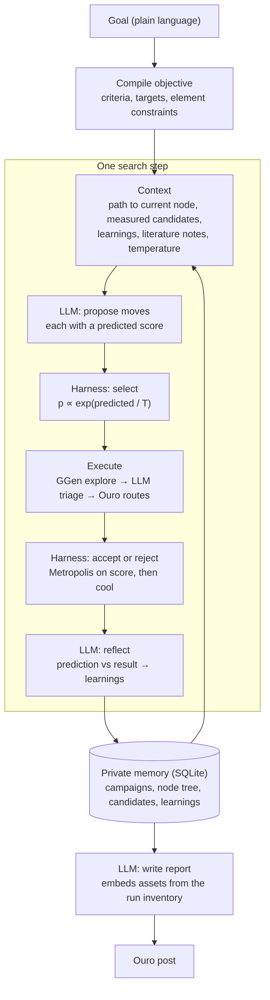

```mermaid
graph TB
    GOAL["Goal (plain language)"] --> OBJ["Compile objective<br/>criteria, targets, element constraints"]
    OBJ --> CTX

    subgraph step [One search step]
        CTX["Context<br/>path to current node, measured candidates,<br/>learnings, literature notes, temperature"]
        PROP["LLM: propose moves<br/>each with a predicted score"]
        SEL["Harness: select<br/>p ∝ exp(predicted / T)"]
        EXE["Execute<br/>GGen explore → LLM triage → Ouro routes"]
        ACC["Harness: accept or reject<br/>Metropolis on score, then cool"]
        REF["LLM: reflect<br/>prediction vs result → learnings"]
        CTX --> PROP --> SEL --> EXE --> ACC --> REF
    end

    REF --> MEM[("Private memory (SQLite)<br/>campaigns, node tree, candidates, learnings")]
    MEM --> CTX
    MEM --> REP["LLM: write report<br/>embeds assets from the run inventory"]
    REP --> POST["Ouro post"]
```
